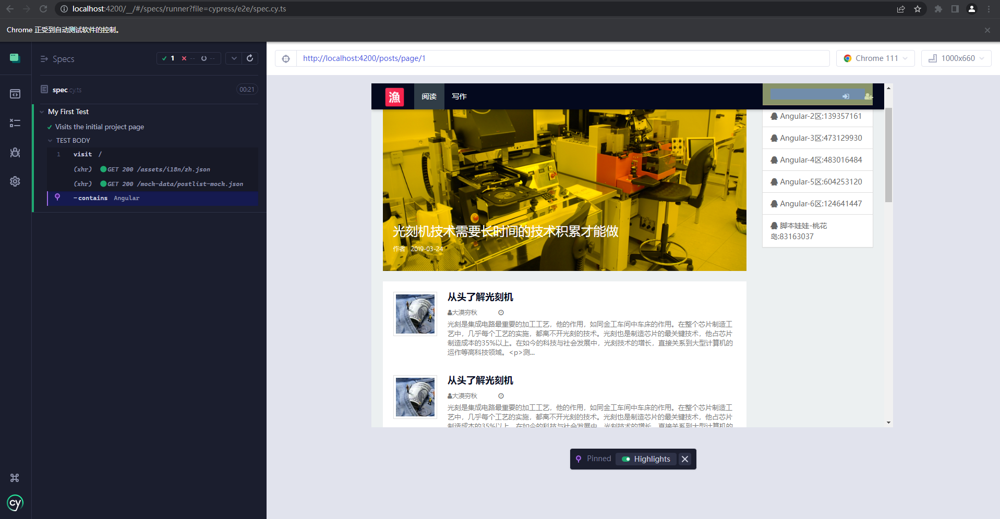

    

<h1 align="center">NiceFish</h1>

NiceFish（美人鱼） 是一个系列项目，目标是示范前后端分离的开发模式:前端浏览器、移动端、Electron 环境中的各种开发模式；后端有两个版本：SpringBoot 版本和 SpringCloud 版本。

## 主要依赖

- Angular 15.2.0
- PrimeNG 15.2.0
- Bootstrap 3.3.7
- Echarts 4.1.0
- ngx-echarts 4.1.0
- ckeditor5-angular 5.2.1

**注意：为了防止依赖冲突，本项目在 package.json 中锁定了所有 Node 模块版本，如有需要，您可以自己测试兼容版本号（不建议这样做，因为会消耗掉大量的时间）。**

## 启动项目

打开终端，依次执行以下命令：

    git clone https://gitee.com/mumu-osc/NiceFish.git
    cd NiceFish
    npm i -g @angular/cli
    npm i
    ng serve --open

打开浏览器，访问 http://localhost:4200/

**中文开发者**：网络原因，推荐安装 nrm 来管理 npm 的 registry。

    npm i -g nrm 
    nrm use taobao

这时候用 npm 安装 node 模块就会使用 taobao 提供的 registry 了。

## 单元测试

执行以下命令进行单元测试：

    ng test

代码覆盖率报告：

关于单元测试的详细使用方法，以及 Jasmine 的语法，请参考： https://angular.io/guide/testing

## 集成测试

从 v12 开始，官方废弃了原来的集成测试工具 Protractor ，此项目已经切换到官方推荐的 Cypress 集成测试工具，执行以下命令启动集成测试：

    ng e2e 

关于 Cypress 的技术细节，请参考： https://testing-angular.com/end-to-end-testing/#end-to-end-testing

## 常见坑点

* 中文开发者：如果你使用 cnpm 来安装依赖，可能会导致某些包不一致，导致应用起不来，目前原因不明，需要 cnpm 官方来解决。
* 如果你遇到任何看起来比较玄幻的问题，请手动删掉 node_modules 目录，然后切换到 npm 官方源，重新安装所有 node 模块
* 构建最终产品版本：ng build
* 如果之前装过@angular/cli 需要先卸载：npm uninstall -g @angular/cli
* 如果之前装过老版本的 angular-cli 需要先卸载：npm uninstall -g angular-cli
* 如果你之前已经尝试用npm install安装过 node 模块，请手动把 NiceFish 根目录下的 node_moduels 目录删掉重新 npm install
* 命令行删除 node_modules 速度更快，Windows 平台使用： rmdir /s/q node_modules ，*nix平台使用：sudo rm -rf node_modules
* 如果你需要把项目发布到其它类型的 Server 上，例如 Tomcat，需要对 Server 进行一些简单的配置才能支持 HTML5 下的 PushState 路由模式，请从以下链接里面查找对应的配置方式：https://github.com/angular-ui/ui-router/wiki/Frequently-Asked-Questions ，在
How to: Configure your server to work with html5Mode 这个小节里面把常见的 WEB 容器的配置方式都列举出来了，包括：IIS、Apache、nginx、NodeJS、Tomcat 全部都有。（请注意，这个配置不是 Angular 所特有的，当前主流的 SPA 型前端框架都需要做这个配置。）

## 直接部署到 nginx

运行 ng build 构建出最终产物。

安装好 nginx，把 dist/browser 目录下的所有内容拷贝到 nginx 的 html 目录下。

参考 nginx.conf 配置文件，修改配置（此项目中的默认配置用于 Docker 环境，在 Windows 平台下无法使用）。

启动 nginx。

## 部署到 Docker 环境

请依次执行以下命令（请不要使用我的 ID ，改成你自己的 Docker 平台 ID ）：

1. 构建镜像：sudo docker build -t damoqiongqiu/nice-fish .
2. 查看镜像列表：sudo docker images
3. 启动容器：sudo docker run -d -it -p 8080:80/tcp --name nice-fish damoqiongqiu/nice-fish:latest
4. 查看运行中的容器：sudo docker ps -a
5. 查看容器日志：docker logs --details CONTAINER_ID
6. 进入容器：sudo docker exec -it CONTAINER_ID sh

## 系列项目

|  名称   | 描述  |
|  ----  | ----  |
| NiceFish（美人鱼）  | 这是一个系列项目，目标是示范前后端分离的开发模式:前端浏览器、移动端、Electron 环境中的各种开发模式。后端有两个版本：SpringBoot 版本和 SpringCloud 版本，http://git.oschina.net/mumu-osc/NiceFish/ |
| nicefish-ionic  | 这是一个移动端的 demo，基于 ionic，此项目已支持 PWA。http://git.oschina.net/mumu-osc/nicefish-ionic |
| NiceBlogElectron  | 这是一个基于 Electron 的桌面端项目，把 NiceFish 用 Electron 打包成了一个桌面端运行的程序。这是由 ZTE 中兴通讯的前端道友提供的，我 fork 了一个，有几个 node 模块的版本号老要改，如果您正在研究如何利用 Electron 开发桌面端应用，请参考这个项目，https://github.com/damoqiongqiu/NiceBlogElectron|
| OpenWMS  | 用来示范管理后台型系统的最佳实践，https://gitee.com/mumu-osc/OpenWMS-Frontend|
| nicefish-springboot  | 用来示范前后端分离模式下，前端代码与后端服务的对接方式，已经完成了基线版本，并且在腾讯云上面做了实际的部署。代码仓库在这里： https://gitee.com/mumu-osc/nicefish-spring-boot ，腾讯云上的演示地址在这里： http://118.25.136.164 ，以此为基础，你可以继续开发出适合自己业务场景的代码。|
| nicefish-springcloud  | 用来示范前后端分离模式下，前端代码与分布式后端服务的对接方式，即将完成，代码最近放出。|
| NiceFish-React  |  这是React 版本，基于React 18.0.0 ，使用 Antd、Inversify、 定制版 Bootstrap开发。  https://gitee.com/mumu-osc/NiceFish-React.git|s
## 界面截图

## 打包分析

以下是用 webpack-bundle-analyzer 分析打包之后的模块构成：

看起来CKEditor和ECharts占了很大的体积，需要做一下异步加载。

webpack-bundle-analyzer 使用方法，请依次执行以下操作：

1. npm i webpack-bundle-analyzer --save-dev
1. package.json 的 scripts 配置里面加一行 "bundle-report": "webpack-bundle-analyzer dist/browser/stats.json"
1. ng build --stats-json 编译（--stats-json 选项会生成一份stats.json配置文件）
1. 执行 npm run bundle-report 查看打包过程

## 学习资源

- 历次演讲中的所有 PPT 已经本项目对应的资料都在这里，您可以随意使用，https://gitee.com/mumu-osc/NiceFish/attach_files 。
- 这里有93篇文章，详细解析了这个项目，或许对你有用：https://gitbook.cn/gitchat/column/5bebdaf22c33167c317cc285

## 开源许可证

MIT