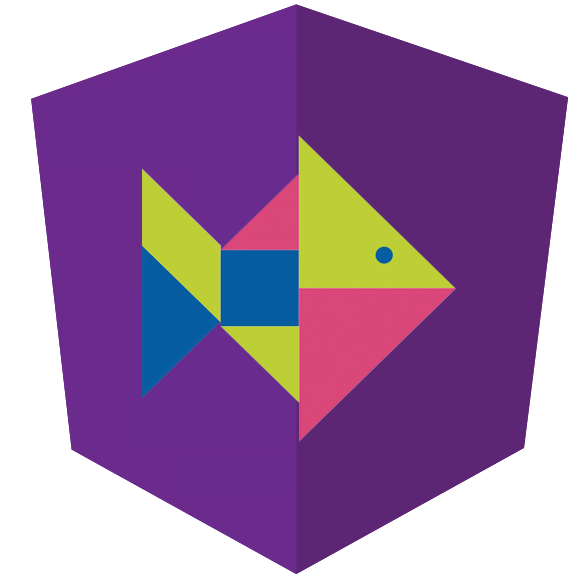

# NiceFish（美人鱼）

NiceFish是一个系列教学项目，都是Angular这个技术栈。

- NiceFish：美人鱼，这是一个微型Blog系统，前端基于Angular 4.x + PrimeNG。http://git.oschina.net/mumu-osc/NiceFish/

- NiceFish-Admin：这是系统管理界面，基于Angular 4.x+PrimeNG，http://git.oschina.net/mumu-osc/NiceFish-Admin

- NiceFish-ionic：这是一个移动端的demo，基于ionic。http://git.oschina.net/mumu-osc/nicefish-ionic

- NiceFish-SpringMybatis：这是Java版后台服务，http://git.oschina.net/mumu-osc/NiceFish-SpringMybatis 

- NiceBlogElectron：https://github.com/damoqiongqiu/NiceBlogElectron ,这是一个基于Electron的桌面端项目，把NiceFish用Electron打包成了一个桌面端运行的程序。这是由ZTE中兴通讯的前端道友提供的，我fork了一个，有几个node模块的版本号老要改，如果您正在研究如何利用Electron开发桌面端应用，请参考这个项目。

- OpenWMS：https://gitee.com/mumu-osc/OpenWMS-Frontend ，这是OpenWMS项目的前端代码，基于当前最新的Angular 5.2.0和PrimeNG 4.1.0。

## 在线演示

NiceFish:    http://47.104.13.149:4200

NiceFish-Admin:   http://47.104.13.149:8080

OpenWMS：http://47.104.80.251:4200

（比较穷，买了一个阿里云小主机，您担待。）

## 用法

用git克隆本项目，从命令行进入进入项目根目录，依次执行以下命令：

	npm i -g cnpm --registry=https://registry.npm.taobao.org
	cnpm i -g @angular/cli
	cnpm install
	ng serve

- 如果之前装过@angular/cli需要先卸载：npm uninstall -g @angular/cli
- 如果之前装过angular-cli需要先卸载：npm uninstall -g angular-cli
- 如果你之前已经尝试安装过node模块，请把NiceFish根目录下的node_moduels目录删掉

然后依次执行以下命令：

	npm cache clean
	npm prune
	npm i -g cnpm --registry=https://registry.npm.taobao.org
	cnpm i -g @angular/cli
	cnpm install
	ng serve

打开你的浏览器，访问http://localhost:4200/

如果你想让加载的包更小，请使用以下方式启动@angular/cli内置的轻量级http server

	ng serve --prod

如果你需要把项目发布到其它类型的Server上，例如Tomcat，需要对Server进行一些简单的配置才能支持HTML5下的PushState路由模式，请从以下链接里面查找对应的配置方式：https://github.com/angular-ui/ui-router/wiki/Frequently-Asked-Questions ，在
How to: Configure your server to work with html5Mode这个小节里面把常见的WEB容器的配置方式都列举出来了，包括：IIS、Apache、nginx、NodeJS、Tomcat全部都有，你过去抄过来就行。

【注意】如果你发现ng serve起不来，或者起来有报错，请把NiceFish根目录下的node_modules目录删掉，然后重新执行cnpm install，全局的@angular/cli也需要删掉重装。

## 如何更新NiceFish的代码

打开命令行，进入NiceFish根目录，依次执行以下命令：

	git pull
	cnpm update
	ng serve

噢对，如果你pull代码之后发现起不来了，请把你项目下的node_modules全部删掉，然后重新cnpm update。这里确实有点坑，但是我也不知道为什么，目测是npm包的版本问题。

## TreeShaking

开发状态打出来的bundle体积比较大，在发布到生产环境之前需要进行TreeShaking，用法如下：

打开命令行，进入NiceFish根目录，执行以下命令：
	
	ng build --prod

加上prod参数之后，@angular/cli会利用envionments/envionments.prod.js里面的配置项来构建项目，同时会自动启用TreeShaking（摇树）特性，简而言之，就是把用不到的包全部剔除掉，就像从树上把枯叶子摇下来一样，很形象吧？

@angular/cli会在项目根目录下生成一个dist目录，里面就是编译、压缩好的文件了。仔细观察你会发现，这些文件的体积已经被大幅度压缩，加上gzip之后有一些文件只剩下1/4左右的大小。

## 在线交流QQ群

<a target="_blank" href="//shang.qq.com/wpa/qunwpa?idkey=8db5ed802cbddbf6432d7ba7dc4f2a316be020442491eb41cbfb1a12434e8cc7" class="list-group-item"><i class="fa fa-qq" aria-hidden="true"></i> Angular-1区-丝绸之路（满）</a>

<a target="_blank" href="//shang.qq.com/wpa/qunwpa?idkey=cbfcd79e7e90939b0e2c519f475fac4792985ce2abc5ad45ec5e06ffcfe944dd" class="list-group-item"><i class="fa fa-qq" aria-hidden="true"></i> Angular-2区-敦煌（满）</a>

<a target="_blank" href="//shang.qq.com/wpa/qunwpa?idkey=639229c8b6ad0c3a9a8f381dddf5d7785780b20d8c37eb25c91ac73ea7d37a5f" class="list-group-item"><i class="fa fa-qq" aria-hidden="true"></i> Angular-3区-玉门关（满）</a>

<a target="_blank" href="//shang.qq.com/wpa/qunwpa?idkey=12add102af3f67910bdc0de753dee10ebada08ab485af7e38f4dfa0ee27476f7" class="list-group-item"><i class="fa fa-qq" aria-hidden="true"></i> Angular-4区-河西走廊（满）</a>

<a target="_blank" href="//shang.qq.com/wpa/qunwpa?idkey=1293a6494fb306ea29d281e320a8f4ef82285fa5300f73118e6ff7a79ce76036"
class="list-group-item"><i class="fa fa-qq" aria-hidden="true"></i>
Angular-5区-楼兰（将满）
</a>

<a target="_blank" href="//shang.qq.com/wpa/qunwpa?idkey=fcd880ba919983dc85690642d48cf00ad0affd8d35de5f30542c895e622a8ab8"
class="list-group-item"><i class="fa fa-qq" aria-hidden="true"></i>
Angular-6区-凉州（将满）
</a>

<a target="_blank" href="//shang.qq.com/wpa/qunwpa?idkey=5d6b8c5296e4806142b8422ae7abca6f27b9b9b992a4dac80dc1392644e8970a"><i class="fa fa-qq" aria-hidden="true"></i>脚本娃娃-桃花岛（将满）</a>

如果您有Angular相关的问题需要讨论，或者单纯想跟我Say Hello，请加上面几个扣扣群。注意，我每天都会收到大量的求助消息，真的有点忙，所以请您优先在扣扣群里面讨论问题。

## 学习资源和视频教程

大漠演讲中的所有PPT已经本项目对应的资料都在这里，您可以随意使用，https://gitee.com/mumu-osc/NiceFish/attach_files 。

如果您需要教程，请自己来这里查看，http://www.ngfans.net/ ，有视频也有文字，有免费版本也有收费版，您自己看着选。

## 开源许可证
 MIT

 你可以随意使用此项目，无需通知我，因为我可能很忙没空搭理你。
